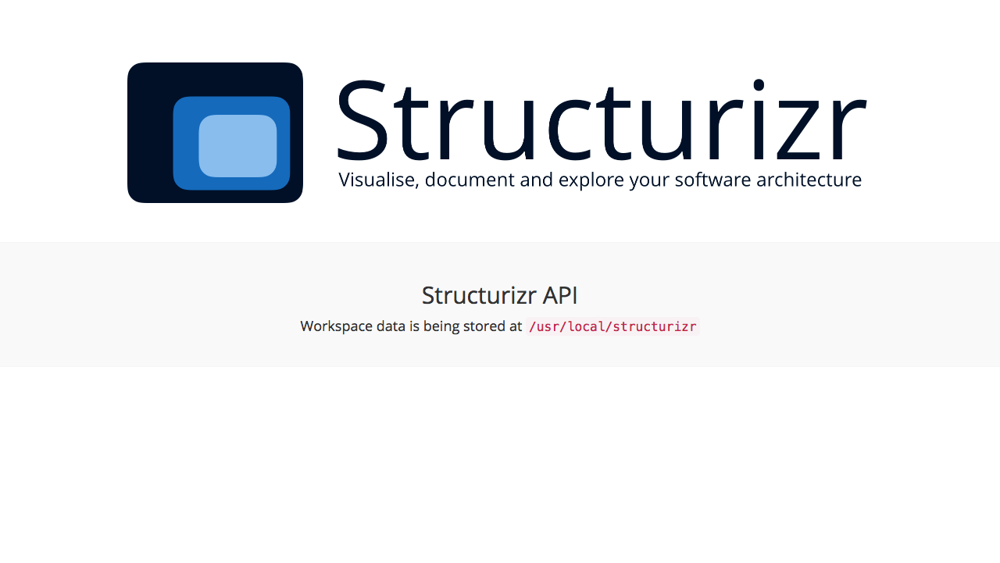

# Structurizr API

This GitHub repository is a simple implementation of the Structurizr API, which is designed to be run on-premises to support Structurizr's [on-premises API feature](https://structurizr.com/help/on-premises-api). It supports the two basic operations required to ```GET``` and ```PUT``` workspaces, with workspace definitions being stored on the file system.

From a technical perspective, this implementation is a simple Java EE web application that can be run on a server such as Apache Tomcat, Jetty, etc.

## Data storage

Workspace data is stored on the file system, in the location defined by the ```dataDirectory``` parameter in the ```web.xml``` configuration file. By default, this is set to ```/usr/local/structurizr```.

This data directory contains one sub-directory per workspace, each of which is named to reflect the workspace ID. Underneath each workspace sub-directory are three files:

- ```workspace.json``` - the workspace definition as JSON
- ```key.txt``` - the Structurizr API key for the workspace
- ```secret.txt``` - the Structurizr API secret for the workspace

## Building from source

To build the Structurizr API from the source code, you need to clone this repository and run the Gradle build. Java 8 is required.

```
git clone https://github.com/structurizr/api.git structurizr-api
cd structurizr-api
./gradlew build assemble
```

The ```build/libs``` directory will contain the assembled WAR file when the build is successful.

## Deploying into Apache Tomcat

To deploy the Structurizr API into your Java EE server, follow the deployment instructions provided by the server vendor. For Apache Tomcat, the simplest method is to copy the WAR file to the ```$CATALINA_HOME/webapps``` directory.

Due to the [Same-origin policy](https://developer.mozilla.org/en-US/docs/Web/Security/Same-origin_policy), the Structurizr API needs to be accessible using HTTPS. A self-signed certificate is sufficient. See [SSL/TLS Configuration HOW-TO](https://tomcat.apache.org/tomcat-8.0-doc/ssl-howto.html) for information about configuring HTTPS.

If deployment is successful, you should see a page like this when you navigate to the webapp URL in your web browser.



## Using the Docker image

This repository also includes a Dockerfile that can be used to create a Docker image consisting of Java 8, Apache Tomcat 8.x and the Structurizr API web application.

A __pre-built Docker image__ is available on the [Docker Hub](https://hub.docker.com/r/structurizr/api/). You can pull a copy of the image using the following command.

```docker pull structurizr/api```

You can then run the Docker image using a command like the following.

```docker run -p 9999:8443 -v .:/usr/local/structurizr structurizr/api```

### Publishing the HTTPS port

By default, the Docker container doesn't expose any ports, although Apache Tomcat is listening for HTTPS requests on port 8443. The ```-p 9999:8443``` parameter in the above command publishes this port, making it accessible outside of the container on port 9999.

### Configuring data storage

The Structurizr API is configured to use ```/usr/local/structurizr``` for data storage. On startup of the container, you need to mount a data volume so that the Structurizr API inside the container can store data outside of the container. Keeping the data stored outside of the container allows you to upgrade the container in the future, while retaining your data.

The ```-v .:/usr/local/structurizr``` parameter in the above command maps the current directory (```.```) to ```/usr/local/structurizr``` in the container.

## TODO

- Generating a self-signed certificate.
- Trusting a self-signed certificate from Java, web browser, etc.
- Configuring the certificate in Apache Tomcat.
- Running the Docker image with an external data volume.
- Configuring the certificate for Docker.
- Preparing a workspace for local API access.
