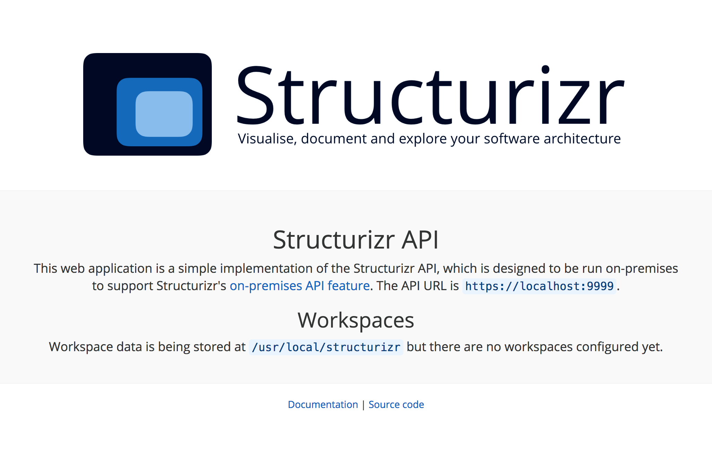

## Deployment

The on-premises API is a Java EE web application, which can be packaged as a WAR file for deployment into any compatible Java EE server.
It has been tested on Java 8 and Apache Tomcat 7/8.

### Configuration

By default, the on-premises API is configured to use ```/usr/local/structurizr``` for data storage, and this can be changed by setting one of the following:

- A JNDI environment entry for the web application context called ```structurizr/dataDirectory```. With Apache Tomcat, you can do this by [defining a context](http://tomcat.apache.org/tomcat-7.0-doc/config/context.html#Defining_a_context)
and [adding an environment entry](http://tomcat.apache.org/tomcat-7.0-doc/config/context.html#Environment_Entries).
- A system property of ```structurizr.dataDirectory```. You can specify this on the command line when starting up the JVM (e.g. ```-Dstructurizr.dataDirectory=/some/path```). For Apache Tomcat you can set this using the ```JAVA_OPTS``` environment variable.
- An environment variable called ```STRUCTURIZR_DATA_DIRECTORY```.

### Java EE server

To deploy the Structurizr API into your Java EE server, follow the deployment instructions provided by the server vendor.
For Apache Tomcat, the simplest method is to copy the WAR file to the ```$CATALINA_HOME/webapps``` directory.
To run the on-premises API as the root web application, rename the WAR file to be ```ROOT.war```.

Additionally, the on-premises API server needs to be accessible over HTTPS; see [SSL/TLS Configuration HOW-TO](https://tomcat.apache.org/tomcat-8.0-doc/ssl-howto.html) for information about configuring HTTPS in Apache Tomcat.

#### Apache Tomcat on Microsoft Azure

When deploying the on-premises API onto a "Web App" "App Service" running on Microsoft Azure, you may see a ```ERR_TOO_MANY_REDIRECTS``` error in your web browser when trying to view the home page.
This is caused by Azure terminating the SSL connection before it gets to the Apache Tomcat server, so Apache Tomcat sees a regular HTTP connection.
Some configuration in the ```web.xml``` file says that all connections must be made using SSL, so Apache Tomcat sends a redirect for the HTTPS version again. And the cycle repeats.
To fix this, simply remove the entire ```security-constraint``` block from the ```web.xml``` file.

### Docker

The [GitHub repository](https://github.com/structurizr/api) also includes a Dockerfile that can be used to create a Docker image consisting of Java 8, Apache Tomcat 8.x and the Structurizr API web application.
A __pre-built Docker image__ is available on the [Docker Hub](https://hub.docker.com/r/structurizr/api/). You can pull a copy of the image using the following command.

```
docker pull structurizr/api
```

You can then run the Docker image using a command like the following.

```
docker run -p 9999:8443 -v /Users/simon/structurizr:/usr/local/structurizr structurizr/api
```

After starting the Docker container, you should be able to navigate to, for example, [https://localhost:9999](https://localhost:9999) in your web browser and see the Structurizr API home page.

#### Publishing the HTTPS port

By default, the Docker container doesn't expose any ports, although Apache Tomcat is listening for HTTPS requests on port 8443. The ```-p 9999:8443``` parameter in the above command publishes this port, making it accessible outside of the container on port 9999.

#### Configuring data storage

The on-premises API is configured to use ```/usr/local/structurizr``` for data storage. On startup of the container, you need to mount a data volume so that the Structurizr API inside the container can store data outside of the container. Keeping the data stored outside of the container allows you to upgrade the container in the future, while retaining your data.

The ```-v /Users/simon/structurizr:/usr/local/structurizr``` parameter in the above command maps the local ```/Users/simon/structurizr``` directory to ```/usr/local/structurizr``` inside the container.

#### Configuring HTTPS

To support HTTPS, Apache Tomcat within the Docker container is configured to look for a Java keystore at ```/usr/local/structurizr/keystore.jks``` and if you start the container without providing a Java keystore, you will see the following error message.
```java.io.FileNotFoundException: /usr/local/structurizr/keystore.jks (No such file or directory)```

### Same-origin policy and SSL

Due to the [Same-origin policy](https://developer.mozilla.org/en-US/docs/Web/Security/Same-origin_policy), the on-premises API needs to be accessible using HTTPS. A self-signed certificate is sufficient.
Although configuring an SSL certificate is out of the scope of this documentation, you can get started by generating a self-signed certificate using the following command.

```
keytool -genkey -alias tomcat -keyalg RSA -keystore /Users/simon/structurizr/keystore.jks
```

Enter ```password``` for the keystore password when prompted.

```
Enter keystore password:  
Re-enter new password: 
What is your first and last name?
  [Unknown]:  localhost
What is the name of your organizational unit?
  [Unknown]:  
What is the name of your organization?
  [Unknown]:  My organization
What is the name of your City or Locality?
  [Unknown]:  
What is the name of your State or Province?
  [Unknown]:  
What is the two-letter country code for this unit?
  [Unknown]:  JE
Is CN=localhost, OU=Unknown, O=My organization, L=Unknown, ST=Unknown, C=JE correct?
  [no]:  y

Enter key password for <tomcat>
	(RETURN if same as keystore password): 
```

If deployment is successful, you should see a page like this when you navigate to the webapp URL in your web browser.



You will need to trust the certificate in your web browser if using a self-signed certificate.
