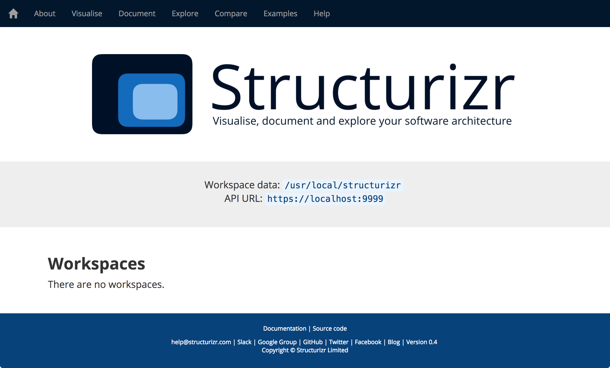

# Deployment

To deploy the Structurizr API into your Java EE server, follow the deployment instructions provided by the server vendor. For Apache Tomcat, the simplest method is to copy the WAR file to the ```$CATALINA_HOME/webapps``` directory.

Due to the [Same-origin policy](https://developer.mozilla.org/en-US/docs/Web/Security/Same-origin_policy), the Structurizr API needs to be accessible using HTTPS. A self-signed certificate is sufficient. See [SSL/TLS Configuration HOW-TO](https://tomcat.apache.org/tomcat-8.0-doc/ssl-howto.html) for information about configuring HTTPS in Apache Tomcat.

If deployment is successful, you should see a page like this when you navigate to the webapp URL in your web browser.



## Docker

The [GitHub repository](https://github.com/structurizr/api) also includes a Dockerfile that can be used to create a Docker image consisting of Java 8, Apache Tomcat 8.x and the Structurizr API web application.

A __pre-built Docker image__ is available on the [Docker Hub](https://hub.docker.com/r/structurizr/api/). You can pull a copy of the image using the following command.

```
docker pull structurizr/api
```

You can then run the Docker image using a command like the following.

```
docker run -p 9999:8443 -v /Users/simon/structurizr:/usr/local/structurizr structurizr/api
```

### Publishing the HTTPS port

By default, the Docker container doesn't expose any ports, although Apache Tomcat is listening for HTTPS requests on port 8443. The ```-p 9999:8443``` parameter in the above command publishes this port, making it accessible outside of the container on port 9999.

### Configuring data storage

The Structurizr API is configured to use ```/usr/local/structurizr``` for data storage. On startup of the container, you need to mount a data volume so that the Structurizr API inside the container can store data outside of the container. Keeping the data stored outside of the container allows you to upgrade the container in the future, while retaining your data.

The ```-v /Users/simon/structurizr:/usr/local/structurizr``` parameter in the above command maps the local ```/Users/simon/structurizr``` directory to ```/usr/local/structurizr``` inside the container.

### Configuring HTTPS

To support HTTPS, Apache Tomcat within the Docker container is preconfigured to look for a Java keystore at ```/usr/local/structurizr/keystore.jks``` and if you start the container without providing a Java keystore, you will see the following error message.
```java.io.FileNotFoundException: /usr/local/structurizr/keystore.jks (No such file or directory)```

Although configuring an SSL certificate is out of the scope of this documentation, you can get started by generating a self-signed certificate using the following command.

```
keytool -genkey -alias tomcat -keyalg RSA -keystore /Users/simon/structurizr/keystore.jks
```

Enter ```password``` for the keystore password when prompted.

```
Enter keystore password:  
Re-enter new password: 
What is your first and last name?
  [Unknown]:  localhost
What is the name of your organizational unit?
  [Unknown]:  
What is the name of your organization?
  [Unknown]:  My organization
What is the name of your City or Locality?
  [Unknown]:  
What is the name of your State or Province?
  [Unknown]:  
What is the two-letter country code for this unit?
  [Unknown]:  JE
Is CN=localhost, OU=Unknown, O=My organization, L=Unknown, ST=Unknown, C=JE correct?
  [no]:  y

Enter key password for <tomcat>
	(RETURN if same as keystore password): 
```

After starting the Docker container, you should be able to navigate to, for example, [https://localhost:9999](https://localhost:9999) in your web browser and see the Structurizr API home page. You will need to trust the certificate in your web browser if using a self-signed certificate.