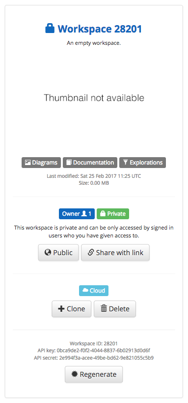

# Usage

To use the on-premises API feature from Structurizr, you need to be subscribed to a [paid plan](https://structurizr.com/pricing) or the free trial.

## Create an empty cloud workspace

In order to use the on-premises API feature, you need to create a cloud workspace that tells Structurizr where to find the local, on-premises API.
This is just an empty workspace - none of your data will be stored here.

After signing in to Structurizr, create a new workspace by clicking the "Create a new empty workspace" button on your dashboard.



Using the Structurizr client library, you then need to update the workspace by specifying a local API that should be used for getting and putting workspace data. For example, with Java.

```java
Workspace workspace = new Workspace("My workspace", "A description of my workspace");
workspace.setApi("https://localhost:9999");
StructurizrClient structurizrClient = new StructurizrClient("0bca9de2-f0f2-4044-8837-6b02913d0d6f", "2e994f3a-acee-49be-bd62-9e821055c5b9");
structurizrClient.putWorkspace(28201, workspace);
```

If successful, you will see a message in the program output.

```
INFO  StructurizrClient - Putting workspace with ID 28201
INFO  StructurizrClient - {"message":"OK"}
```

You will also notice that the "Cloud" icon has been replaced with one that says, "On-premises API". 


## Copy workspace key and secret to the on-premises API

With the remote workspace created, you next need to copy the workspace key and secret to the on-premises API server.
The easiest way to do this is to click the "Sync" button next to the key and secret on your dashboard (see previous screenshot).

You can also POST the data to the local API server, using a command like the following.

```
curl --data "key=0bca9de2-f0f2-4044-8837-6b02913d0d6f&secret=2e994f3a-acee-49be-bd62-9e821055c5b9" https://localhost:9999/workspace/28201 --insecure
```

Alternatively, you can do this manually by opening a command prompt and changing to the directory that the Structurizr API is using to store data. This directory needs to contain a sub-directory for the workspace, which itself needs to contain a ```key.txt``` and ```secret.txt``` file.
The contents of these files must correspond to the values shown on your Structurizr dashboard. For example.

```
mkdir 28201
cd 28201
echo '0bca9de2-f0f2-4044-8837-6b02913d0d6f' > key.txt
echo '2e994f3a-acee-49be-bd62-9e821055c5b9' > secret.txt
```

## Push your workspace to the on-premises API

You can now use the Structurizr client library in the usual way, with the exception that the on-premises API URL needs to be specified when creating the ```StructurizrClient``` object.

```java
StructurizrClient structurizrClient = new StructurizrClient("https://localhost:9999", "0bca9de2-f0f2-4044-8837-6b02913d0d6f", "2e994f3a-acee-49be-bd62-9e821055c5b9");
Workspace workspace = new Workspace("My workspace", "A description of my workspace");
Model model = workspace.getModel();

Person user = model.addPerson("User", "A user of my software system.");
SoftwareSystem softwareSystem = model.addSoftwareSystem("Software System", "My software system.");
user.uses(softwareSystem, "Uses");

ViewSet viewSet = workspace.getViews();
SystemContextView contextView = viewSet.createSystemContextView(softwareSystem, "Context", "A description of this diagram.");
contextView.addAllSoftwareSystems();
contextView.addAllPeople();

structurizrClient.putWorkspace(28201, workspace);
```

```
INFO  StructurizrClient - Putting workspace with ID 28201
INFO  StructurizrClient - {"message":"OK"}
```

Loading the workspace by clicking the link on your Structurizr dashboard will now load the workspace data from your on-premises API.

### SSL handshake errors

SSL handshake errors are likely if using a self-signed certificate, because the Structurizr client program runtime won't trust the certificate served by the Structurizr API server.

If using the Java client, you can use ```javax.net.ssl.trustStore``` JVM option to point to your keystore. For example.

```
-Djavax.net.ssl.trustStore=/Users/simon/Desktop/structurizr/keystore.jks
```

Alternatively, you can specify this property in your Java program.

```
System.setProperty("javax.net.ssl.trustStore", "/Users/simon/Desktop/structurizr/keystore.jks");
```

If using the .NET client, you'll need to export the certificate from the keystore and install it into the "Trusted Root Certification Authories" certificate store. Double-clicking the certificate file in the File Explorer should open the certificate details, from which you can install the certificate.

```
keytool -export -keystore keystore.jks -alias tomcat -file tomcat.cer
```

## Serving static images

Any image files stored in the workspace sub-directory can be accessed using a URL like the following:

```https://localhost:9999/workspace/28201/some-image.png```

This allows you to store images on the on-premises API server, and reference them in the supplementary Markdown or AsciiDoc documentation.