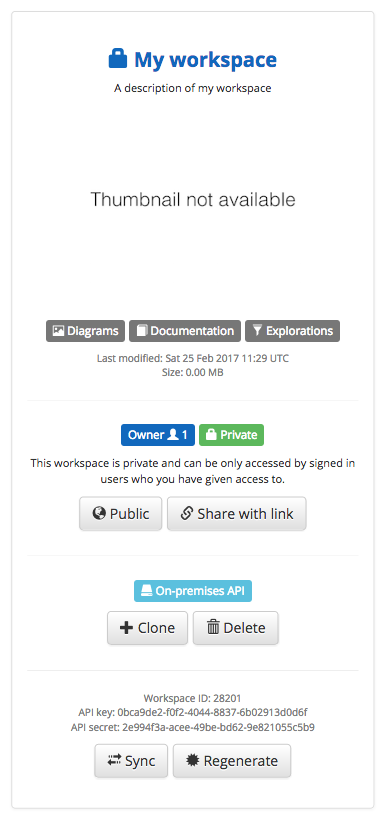

To use the on-premises API feature from Structurizr, you need to be subscribed to the [On-premises Plan](https://structurizr.com/pricing) or the free trial.

### Creating a remote workspace

In order to use the on-premises API feature, you need to create a remote workspace that tells Structurizr where to find the local, on-premises API. This is just an empty workspace - none of your data will be stored here.

After signing in to Structurizr, create a new workspace by clicking the "Create a new empty workspace" button on your dashboard.


Using the Structurizr client library, you then need to update the workspace by specifying a remote API that should be used for getting and putting workspace data. For example, with Java.

```java
Workspace workspace = new Workspace("My workspace", "A description of my workspace");
workspace.setApi("https://localhost:9999");
StructurizrClient structurizrClient = new StructurizrClient("5855ca93-73f6-4736-95c5-d7b6e2f43c30", "6fc691f0-789a-4075-8c6a-707e80c0537c");
structurizrClient.putWorkspace(18561, workspace);
```

If this succeeded, you will see a message in the program output.

```
INFO  StructurizrClient - Putting workspace with ID 18561
INFO  StructurizrClient - {"message":"OK"}
```

You will also notice that the "Cloud" icon has been replaced with one that says, "On-premises API". 



### Preparing the local workspace

With the remote workspace created, you next need to prepare the local Structurizr API. You can do this by opening a command prompt and changing to the directory that the Structurizr API is using to store data. This directory needs to contain a sub-directory for the workspace, which itself needs to contain a ```key.txt``` and ```secret.txt``` file. The contents of these files must correspond to the values shown on your Structrizr dashboard. For example.

```
mkdir 18561
cd 18561
echo '5855ca93-73f6-4736-95c5-d7b6e2f43c30' > key.txt
echo '6fc691f0-789a-4075-8c6a-707e80c0537c' > secret.txt
```

### Using the local workspace

You can now use the Structurizr client library in the usual way, with the exception that the remote API URL needs to be specified when creating the ```StructurizrClient``` object.

```java
StructurizrClient structurizrClient = new StructurizrClient("https://localhost:9999", "5855ca93-73f6-4736-95c5-d7b6e2f43c30", "6fc691f0-789a-4075-8c6a-707e80c0537c");
Workspace workspace = new Workspace("My workspace", "A description of my workspace");
Model model = workspace.getModel();

Person user = model.addPerson("User", "A user of my software system.");
SoftwareSystem softwareSystem = model.addSoftwareSystem("Software System", "My software system.");
user.uses(softwareSystem, "Uses");

ViewSet viewSet = workspace.getViews();
SystemContextView contextView = viewSet.createSystemContextView(softwareSystem, "Context", "A description of this diagram.");
contextView.addAllSoftwareSystems();
contextView.addAllPeople();

structurizrClient.putWorkspace(18561, workspace);
```

```
INFO  StructurizrClient - Putting workspace with ID 18561
INFO  StructurizrClient - {"message":"OK"}
```

SSL handshake errors are likely if using a self-signed certificate because the Structurizr client program runtime won't trust the certificate served by the Structurizr API server. If using the Java client, you can use ```javax.net.ssl.trustStore``` JVM option to point to your keystore. For example.

```
-Djavax.net.ssl.trustStore=/Users/simon/Desktop/structurizr/keystore.jks
```

Loading the workspace by clicking the link on your Structurizr dashboard will now load the workspace data from your on-premises API.

## TODO

- Trusting a self-signed certificate from .NET.
